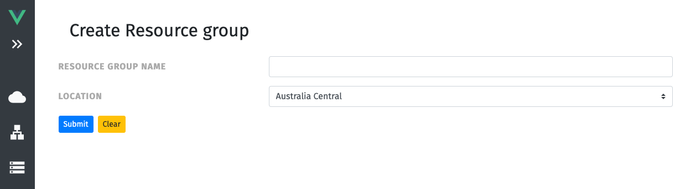
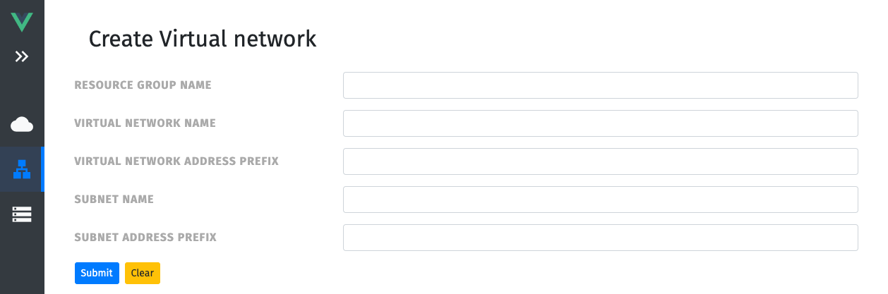
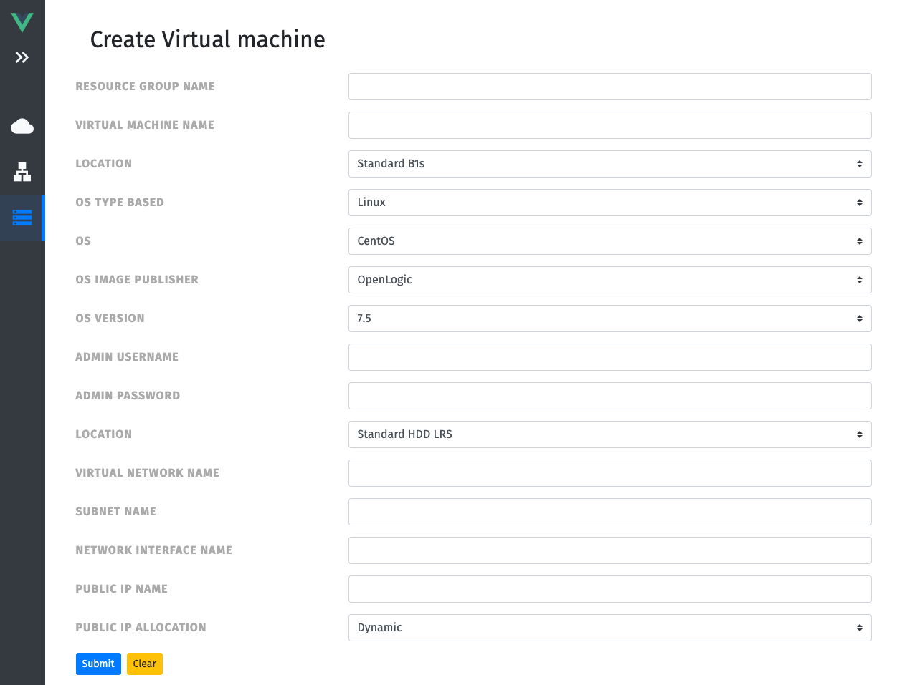

UI
=========

This Vue.js based UI connects the User with Ansible in an easy way. With the help of a form an Azure Resource can be easily created.

Requirements
------------

Following modules have to be installed to run this UI:

- [Node v16.16.0](https://nodejs.org/en/)
- [npm v8.16.0](https://www.npmjs.com/)

Installation / Usage
--------------

```bash
# npm installation
$ npm installation

# Run in dev mode -> Access UI via http://localhost:3000/
$ npm run dev

# Create production build
$ npm run build

```

UI pictures
--------------

**Create Resource group**


**Create Virtual network**


**Create Virtual machine**


License
-------

BSD

Author Information
------------------

- [Flavio Meyer](https://github.com/meyerf99)
- [Michael Simões Mangold](https://github.com/Pleger96)